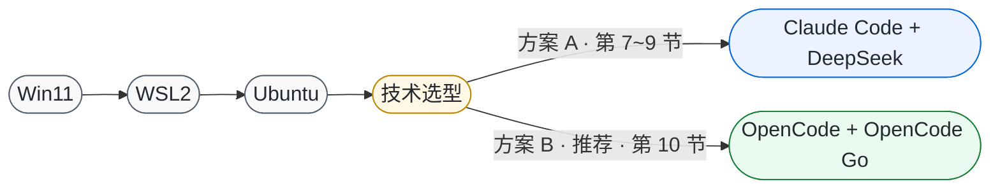

# WSL2 + Ubuntu + AI 编程工具 一键配置工程

在 Windows 11 上**一键搭建 WSL2 + Ubuntu 开发环境**，并接入 AI 编程工具跑大模型。两条方案任选，核心区别一眼看懂：

| | **方案 A** | **方案 B**（推荐） |
|---|---|---|
| 工具 + 模型 | Claude Code CLI + DeepSeek API | OpenCode CLI + OpenCode Go |
| 计费 | 按 token 预充值 | 订阅配额（$10/月） |
| 模型数量 | 2 个 | 9 个，`/models` 随时切换 |
| 适合 | 只用 DeepSeek、能自主控量 | 长期稳定省钱、需要多模型 |

**快速开始：** 方案 A 看 [第 5~9 节](#5-阶段一安装-wsl2--ubuntu)，方案 B 看 [第 10 节](#10-opencode--opencode-go方案-b)。

---

## 目录

- [0. 项目介绍](#0-项目介绍)
- [0.3 技术选型：方案 A 与方案 B](#03-技术选型方案-a-与方案-b)
- [1. 项目解决什么问题](#1-项目解决什么问题)
- [2. 目录结构](#2-目录结构)
- [3. 目标环境实测数据](#3-目标环境实测数据)
- [4. 完整流程总览](#4-完整流程总览)
- [5. 阶段一：安装 WSL2 + Ubuntu](#5-阶段一安装-wsl2--ubuntu)
- [6. 阶段二：创建 UNIX 账号](#6-阶段二创建-unix-账号)
- [7. 阶段三：安装 Claude Code CLI（方案 A）](#7-阶段三安装-claude-code-cli方案-a)
- [8. 阶段四：接入 DeepSeek API（方案 A）](#8-阶段四接入-deepseek-api方案-a)
- [9. 阶段五：验证（方案 A）](#9-阶段五验证方案-a)
- [10. OpenCode + OpenCode Go（方案 B）](#10-opencode--opencode-go方案-b)
- [11. 脚本功能详解](#11-脚本功能详解)
- [12. 排障手册](#12-排障手册)
- [13. 安全须知](#13-安全须知)
- [14. 使用手册](#14-使用手册)

---

## 0. 项目介绍

### 0.1 它是什么

一个**把「Windows 装 Linux 开发环境 + 接国产大模型跑 AI 编程工具」这件事完整脚本化**的工程。

从一台裸的 Windows 11 开始，最终得到：一个 WSL2 的 Ubuntu 环境，里面跑着 AI 编程工具，
背后接的是国产/第三方大模型——全程不需要微软商店、不需要科学上网。

**AI 编程工具提供两套方案**（详见 [0.3 技术选型](#03-技术选型方案-a-与方案-b)）：

- **方案 A**：Claude Code CLI + DeepSeek API（按 token 计费）
- **方案 B**：OpenCode CLI + OpenCode Go（订阅配额，多模型）——**本项目作者当前的主力选择，推荐**

### 0.2 English

A reproducible setup that turns a bare **Windows 11** machine into a working
**WSL2 + Ubuntu** environment running an AI coding tool — **Claude Code CLI**
(on the **DeepSeek API**) or **OpenCode CLI** (on **OpenCode Go**) — without
Microsoft Store and without access to overseas networks.

It is not a "happy path" tutorial. It documents a real troubleshooting session
on a machine where the Store CDN was blocked (403), WSL was only an inbox stub,
a stale registry entry pretended Ubuntu was installed, and PowerShell 5.1 broke
UTF-8 scripts. Every failure has a root cause, a detection method, and a fix
that is baked into the scripts.

Two AI coding tool routes are documented: route A (Claude Code CLI + DeepSeek API)
and route B (OpenCode CLI + OpenCode Go, the author's current daily driver).

---

## 0.3 技术选型：方案 A 与方案 B

两套方案的**前置步骤完全一致**：先完成 WSL2 + Ubuntu 的部署（[第 5 节](#5-阶段一安装-wsl2--ubuntu)、
[第 6 节](#6-阶段二创建-unix-账号)）。二者仅在"Ubuntu 就绪后部署哪一套 AI 编程工具"上产生分岔。



> 文字版等价结构：`Win11 → WSL2 → Ubuntu → 技术选型`，
> 分岔为 **方案 A（Claude Code + DeepSeek，第 7~9 节）**
> 与 **方案 B（OpenCode + OpenCode Go，第 10 节，推荐）**。

### 方案对比

| 维度 | 方案 A：Claude Code + DeepSeek API | 方案 B：OpenCode + OpenCode Go |
|---|---|---|
| 计费模式 | 按 token 预充值计费，余额耗尽即中断 | 订阅配额制（首期 $5 得 $60，续期 $10/月） |
| 成本可控性 | **低**：auto 模式叠加并行子代理时消耗呈指数增长，存在透支风险 | **高**：内置 5 小时 / 每周 / 每月三级配额上限，不会透支 |
| 可选模型数量 | **2 个**：`deepseek-v4-pro`、`deepseek-v4-flash`（`/models` 实测返回的基础 ID，另有 `[1m]` 变体） | **9 个**：GLM-5.2、Kimi K3、Qwen3.8 Max、DeepSeek V4 Flash、GPT-5.6 Luna、Kimi K2.7 Code、LongCat-2.0、Hy3、Muse Spark 1.2 Contributor（`/models` 实测，见 [下节](#方案-b-的多模型能力)） |
| 模型供给 | 单一供应商（DeepSeek），无回退空间 | 多供应商，可按任务切换，具备"换模型重试"的回退手段 |
| 任务准确性 | 模型侧锁定于单一模型，复杂任务跑偏时**无模型层面的补救手段**；工具侧（Claude Code 的 agent 编排、文件编辑与命令执行）工程成熟度较高 | 模型侧可按需切换至更强档位（GLM-5.2 / GPT-5.6 Luna），复杂任务可"换模型重试"；工具侧（OpenCode）相对较新，超长任务的编排一致性略逊 |
| 协议契合度 | Claude Code 仅支持 Anthropic 协议，接入 DeepSeek 依赖其**兼容适配层** | OpenCode 原生多 provider 架构，OpenCode Go 为一等公民 provider |
| 安装依赖 | 官方安装脚本依赖 GitHub，受限网络下需额外处理 | `npm -g opencode-ai`，经 npmmirror 镜像分发，无需访问 GitHub |
| 切换模型成本 | 需修改 `settings.json` 中的模型字段 | TUI 内 `/models` 交互式切换，即时生效 |
| 配置复杂度 | 中：需配置 base URL、三档模型名，并预置文件以跳过登录向导 | 低：仅需写入单个 `auth.json` |
| 生态成熟度 | **较高**：具备 VSCode 扩展，社区资料充分 | 相对较新，插件与第三方教程较少 |
| 网络时延 | DeepSeek 境内直连，时延低 | 模型托管于境外节点，境内存在数十至数百毫秒附加时延 |
| 适用场景 | 仅使用 DeepSeek、可自主控制用量、依赖 VSCode 扩展 | 需长期稳定低成本运行、需按任务选用不同模型、希望免于余额管理 |

### 选型依据：为何推荐方案 B

以下结论均基于实机验证，而非工具偏好。

**1. 计费模型决定成本可控性**

方案 A 采用预充值按量计费。当 Claude Code 进入 auto 模式并派生并行子代理时，
token 消耗呈指数级增长。本项目实测记录：**单夜之内余额由 ¥9.95 变为 −0.99，
次日全部请求返回 HTTP 402**。其成因是后台并行子任务各自循环调用，
而非用户显式发起的请求。

OpenCode Go 采用订阅配额制，并设有 **5 小时 / 每周 / 每月**三级上限。
最坏情况仅触发配额窗口限流，**不存在欠费导致服务完全中断的风险**。
对于需要长期连续推进的课题而言，成本的可预期性本身即构成选型价值。

**2. 模型供给的多源性与任务适配能力**

方案 A 的模型供给锁定于单一供应商。而科研工作中的不同任务对模型能力的要求并不一致：
脚本编写依赖代码能力，长文献阅读依赖上下文长度，文本润色依赖中文表达质量，
批量任务则优先考量单位成本。

方案 B 下这些需求通过 `/models` 单一切换入口即可满足：

| 任务类型 | 推荐模型 | 依据 |
|---|---|---|
| 日常主力（代码 + 科研问答） | **GLM-5.2** | 综合能力最均衡 |
| 长文献 / 整本 PDF 阅读 | **Kimi K3** | 长上下文窗口 |
| 综述撰写与文本润色 | **Qwen3.8 Max** | 中文表达质量 |
| 批量处理（重命名、格式转换） | **DeepSeek V4 Flash** | 单位成本最低 |
| 纯代码编写（临时切换） | Kimi K2.7 Code | 代码特化，不建议作为主力 |

**3. 准确性的两个来源：工具编排能力与模型能力**

评估"哪个更准"时，需要拆成两层看，否则容易得出相反结论：

| 层次 | 方案 A（Claude Code + DeepSeek） | 方案 B（OpenCode + OpenCode Go） |
|---|---|---|
| 工具编排层 | **较强**：agent 编排、文件编辑、命令执行经过大量真实项目打磨，长任务的一致性与错误恢复更成熟 | 相对较新：编排能力已可用，但超长任务的一致性与上下文管理略逊于前者 |
| 模型能力层 | **锁定**：只有 DeepSeek 一家，复杂任务跑偏时无法通过换模型补救，只能改提示词重试 | **可选**：可切换至 GLM-5.2、GPT-5.6 Luna 等更强档位，具备"换模型重试"这一额外补救手段 |

结论是：**方案 A 的优势在工具层、劣势在模型层；方案 B 相反。**
而在实际科研任务中，模型能力往往是准确性的主要瓶颈——同一个任务换一个更强的模型，
结果差异通常大于换一个工具。这也是推荐方案 B 的核心原因之一。

> 实测参照：方案 A 在复杂任务中出现过模型反复循环调用、偏离目标的情况
> （见 [1. 计费模型决定成本可控性](#1-计费模型决定成本可控性) 中的余额记录），
> 此时唯一的处理方式是中断重来；方案 B 则可直接切换模型再试一次。

**4. 协议适配的一等公民支持**

Claude Code 仅实现 Anthropic 协议。DeepSeek 提供的 `/anthropic` 端点虽可用，
但本质是第三方协议的适配层，属降级兼容，其缓存策略与部分工具调用行为
可能与官方实现存在差异，且问题定位链路较长。

OpenCode 在设计上即为多 provider 架构，OpenCode 兼容端点由工具原生支持，
OpenCode Go 无需任何额外的协议转换配置。

**5. 受限网络环境下的可安装性**

- `npm install -g opencode-ai` 经 npmmirror 镜像分发即可完成。
  主包体积仅 3KB，实际二进制位于 `optionalDependencies` 的
  `opencode-linux-x64`（约 57MB）；npmmirror 提供完整镜像，
  且该子包**不含 postinstall 钩子**，不会发起二次下载。
  因此全流程无需访问 GitHub、无需代理。
- 相较之下，Claude Code 的官方安装脚本依赖 GitHub，在受限网络中需额外处理。

**6. 配置收敛为单一文件**

方案 B 的全部鉴权信息即一个 JSON 对象：

```json
{ "opencode-go": { "type": "api", "key": "sk-go-xxxx" } }
```

写入 `~/.local/share/opencode/auth.json` 即可生效。无需如方案 A 般
配置 `ANTHROPIC_BASE_URL`、维护三档模型名、并预置 `~/.claude.json` 以跳过登录向导。

**7. 方案 B 的已知局限**

- 模型节点位于美国 / 欧盟 / 新加坡，**境内访问存在附加时延**，不及 DeepSeek 境内直连
- 生态相对较新，插件与社区教程数量有限
- 尚未提供与 Claude Code 同等成熟度的 VSCode 扩展
- 受配额上限约束，超大规模批量任务可能触发窗口限流

**选型结论：**

> 若目标是长期、稳定、成本可控地以 AI 辅助科研工作，**选择方案 B**；
> 若已深度依赖 Claude Code 的交互范式、仅使用 DeepSeek 且具备用量控制能力，**选择方案 A**。
> 两者共用同一套 WSL2 + Ubuntu 底座，可并行安装并按任务切换，不存在互斥。

### 方案 B 的多模型能力

这是方案 B 相对方案 A 最直观的优势。下表为 **2026-09-22 在 OpenCode Go 中 `/models`
实际返回的模型清单**（共 9 个，列表会随订阅服务更新，以实际返回为准）：

| # | 模型 | 定位 | 推荐场景 |
|---|---|---|---|
| 1 | **GLM-5.2** | 综合旗舰 | 日常主力：写代码 + 科研问答 |
| 2 | **Kimi K3** | 长上下文 | 长文献、整本 PDF 阅读 |
| 3 | **Qwen3.8 Max** | 通用大杯 | 综述撰写、中文润色 |
| 4 | **DeepSeek V4 Flash** | 高速低成本 | 批量小任务，最省额度 |
| 5 | **GPT-5.6 Luna** | 通用强模型 | 需要更强推理时的备选 |
| 6 | Kimi K2.7 Code | 代码特化 | 纯代码编写，可临时切换 |
| 7 | LongCat-2.0 | 通用 | 备用 |
| 8 | Hy3 | 通用 | 备用 |
| 9 | Muse Spark 1.2 Contributor | 轻量 | 备用 |

对比方案 A：`/models` 实测仅返回 `deepseek-v4-pro` 与 `deepseek-v4-flash`
两个基础 ID（另有 `[1m]` 变体）。即 **9 : 2** 的量级差距，且方案 B 覆盖多家供应商，
不存在单一供应商不可用即整体停摆的风险。

切换成本为零：TUI 内输入 `/models` 回车选中即可，仅影响后续对话。

---

## 1. 项目解决什么问题

在 Windows 上配置 WSL2 开发环境时，常规教程（`wsl --install` 一条命令搞定）在以下情况会直接失败：

| 障碍 | 表现 | 本项目对策 |
|---|---|---|
| 微软商店 CDN 不可达 | `wsl --update` 报 **403 已禁止** | 改用 GitHub 的 `--web-download`，或本地 MSI 离线安装 |
| 仅有 inbox 版 WSL | 任何 wsl 命令都提示"**必须更新到最新版本**" | 捆绑现代 WSL 安装包（MSI），脚本自动用 msiexec 安装 |
| 注册表残留孤儿登记 | 显示已装 Ubuntu 但实际目录不存在 | 仅在 BasePath 确实缺失时清理，避免误删数据 |
| PowerShell 中文编码 | `.ps1` 中文变乱码 → **ParserError**，整脚本不执行 | 全部脚本强制 ASCII-only |
| wsl.exe 写 stderr | 配合 `ErrorActionPreference=Stop` 变成终止异常 | 对原生命令统一降级为 Continue，且不重定向 stderr |

---

## 2. 目录结构

```
wsl-ubuntu-setup/
├── README.md                        ← 本文档
├── .gitignore                       ← 排除大文件与含密钥配置
├── scripts/
│   ├── 01-install-wsl-ubuntu.ps1    ← Windows 管理员执行：装 WSL + Ubuntu
│   ├── 02-setup-claude.sh           ← 方案 A：Node.js + Claude Code + DeepSeek 配置
│   ├── 03-verify.sh                 ← 方案 A：逐项自动化验证
│   ├── 04-verify.ps1                ← Windows 执行：概览验证
│   └── 05-install-opencode.sh       ← 方案 B：装 OpenCode + 写 OpenCode Go 鉴权
├── config/
│   └── deepseek-settings.example.json   ← DeepSeek 配置模板（Key 为占位符）
└── docs/
    └── USAGE.md                     ← 装好之后怎么用 Claude Code（日常手册）
```

> **WSL 安装包不进 git 仓库**：`wsl.2.7.14.0.x64.msi` 有 247MB，超过 GitHub 单文件 100MB 上限，
> 已作为 **Release 附件**提供，直接从 [Releases](https://github.com/QianRongAn/wsl2-ubuntu-ai-coding-setup/releases/tag/wsl-2.7.14) 下载（见 [5.2](#52-准备-wsl-安装包)）。

---

## 3. 目标环境实测数据

以下均为真实探测结果，可作为判断自身环境是否适用的参照：

| 项目 | 实测值 |
|---|---|
| 系统 | Windows Build 26220 / 25H2 |
| `Microsoft-Windows-Subsystem-Linux` | Enabled |
| `VirtualMachinePlatform` | Enabled |
| `HypervisorPlatform` | Enabled |
| `System32\wsl.exe` | 10.0.26100.8875（**inbox stub**） |
| `C:\Program Files\WSL` | 安装前**不存在** |
| 微软商店 CDN | 不可达（TLS SNI 干扰 / 403） |
| GitHub | API 可直连；release 资产需走代理 |
| 本机代理 | Clash `127.0.0.1:7890`，系统代理已开启 |

**装成后的终态：**

| 项目 | 值 |
|---|---|
| WSL | `C:\Program Files\WSL\wsl.exe` = **2.7.14.0** |
| 发行版 | Ubuntu（默认，带 `*`） |
| WSL 版本 | **Version = 2** |
| 磁盘镜像 | `ext4.vhdx` 约 1.4 GB |
| 系统 | Ubuntu 26.04.1 LTS |
| 内核 | `6.18.33.2-microsoft-standard-WSL2` |
| UNIX 用户 | `DefaultUid = 1000`（普通用户，非 root） |

---

## 4. 完整流程总览

```
┌─ 阶段一 ─ Windows（管理员 PowerShell）
│   01-install-wsl-ubuntu.ps1
│     ├─ 1/7 检查 Windows 版本
│     ├─ 2/7 校验三项 Windows 功能（缺失则启用并提示重启）
│     ├─ 3/7 安装现代 WSL（本地 MSI → --web-download → 微软 CDN 三级回退）
│     ├─ 4/7 清理孤儿 Lxss 登记（仅当 BasePath 不存在）
│     ├─ 5/7 设置默认 WSL 版本 = 2
│     ├─ 6/7 安装 Ubuntu（--web-download 优先）
│     ├─ 7/7 设为默认发行版
│     └─ 附  写入 %USERPROFILE%\.wslconfig
│
├─ 阶段二 ─ 新终端执行 wsl -d Ubuntu
│     创建 UNIX 用户名 / 密码
│
├─ 阶段三 ─ WSL 内执行 02-setup-claude.sh
│     Node v22（npmmirror 镜像）→ npm 国内镜像 → npm i -g @anthropic-ai/claude-code
│
├─ 阶段四 ─ 同上脚本自动完成
│     写入 ~/.claude/settings.json + 预置 onboarding
│
└─ 阶段五 ─ 03-verify.sh / 04-verify.ps1
       版本 → 配置 → 网络 → 端到端真实调用
```

---

## 5. 阶段一：安装 WSL2 + Ubuntu

### 5.1 前置条件

- Windows 10 2004+ 或 Windows 11
- **管理员权限**
- 若网络受限（微软 CDN 403），需准备可用的代理，并确保节点能访问 GitHub

### 5.2 准备 WSL 安装包

脚本优先使用同目录下的本地 MSI（文件名 `wsl.2.7.14.0.x64.msi`，与本工程验证版本一致）。

**方式一（推荐）：直接下载本仓库 Releases 里已上传的安装包**

```
https://github.com/QianRongAn/wsl2-ubuntu-ai-coding-setup/releases/download/wsl-2.7.14/wsl.2.7.14.0.x64.msi
```

或命令行：

```bash
curl -L -o wsl.2.7.14.0.x64.msi \
  https://github.com/QianRongAn/wsl2-ubuntu-ai-coding-setup/releases/download/wsl-2.7.14/wsl.2.7.14.0.x64.msi
```

**方式二：从微软官方 GitHub Release 下载最新版**

```
https://github.com/microsoft/WSL/releases
```

取 `wsl.<版本>.0.x64.msi`（本工程验证版本：**2.7.14**，247MB）。国内直连缓慢时显式走代理：

```bash
curl -L -x http://127.0.0.1:7890 -o wsl.2.7.14.0.x64.msi \
  https://github.com/microsoft/WSL/releases/download/2.7.14/wsl.2.7.14.0.x64.msi
```

> **通常不需要手动下载**：脚本在拿不到本地 MSI 时，会依次尝试
> `wsl --update --web-download` → `wsl --update` → **自动从本仓库 Release 下载上面的 MSI**，
> 三级都失败才会提示你手动下载。手动下载只在完全无外网的情况下才需要做。

### 5.3 执行

以**管理员身份**打开 PowerShell：

```powershell
Set-ExecutionPolicy -Scope Process -ExecutionPolicy Bypass -Force
& ".\scripts\01-install-wsl-ubuntu.ps1"
```

### 5.4 验证

```powershell
wsl -l -v
```

期望：

```
  NAME      STATE      VERSION
* Ubuntu    Stopped    2
```

两个关键点：`VERSION` 为 **2**（是 WSL2 不是 WSL1）；`Ubuntu` 行首有 `*`（默认发行版）。

### 5.5 如何不跑 wsl 命令判断安装状态

当 wsl 命令不可用时，可直接查注册表与磁盘：

```powershell
Get-ChildItem 'HKCU:\SOFTWARE\Microsoft\Windows\CurrentVersion\Lxss' |
  ForEach-Object { Get-ItemProperty $_.PSPath }
```

| 字段 | 含义 |
|---|---|
| `State = 1` | 已安装 |
| `Version = 2` | WSL2（1 则为 WSL1） |
| `DefaultUid` | `0` = 尚无用户（root）；`1000` = 已建普通用户 |
| `BasePath` | 实际磁盘位置，现代 WSL 为 `AppData\Local\wsl\{guid}` |

配合检查 `BasePath` 下的 `ext4.vhdx` 是否存在及其大小，即可完全判断安装真伪。

---

## 6. 阶段二：创建 UNIX 账号

脚本用了 `--no-launch`，发行版装好但未启动过，因此 **UNIX 账号尚未创建**（此时 `DefaultUid = 0`）。

新开终端：

```powershell
wsl -d Ubuntu
```

依次输入：

```
Enter new UNIX username: dev
New password: ******
Retype new password: ******
```

> 该账号是 WSL 内部账号，与 Windows 账号无关，`sudo` 用的就是它。
> 忘记密码：`wsl -d Ubuntu -u root` 进 root 后 `passwd <用户名>` 重置。

**验证：** 出现形如 `dev@主机名:~$` 的提示符，且 `uname -r` 含 `WSL2`。

> 若提示符显示 `/mnt/c/WINDOWS/system32`，是因为从该目录启动的。执行 `cd ~`，
> 或在 Windows Terminal 把 WSL 配置文件的"起始目录"设为 `~`。

---

## 7. 阶段三：安装 Claude Code CLI（方案 A）

> 走方案 B（OpenCode）的话，**第 7~9 节整段跳过**，直接看 [第 10 节](#10-opencode--opencode-go方案-b)。

在 Ubuntu 内执行（脚本内 `KEY` 需自行提供）：

```bash
DEEPSEEK_API_KEY='sk-你的密钥' bash scripts/02-setup-claude.sh
```

脚本按顺序完成：

1. `apt-get update/upgrade` + 安装 `curl git jq xz-utils build-essential`
2. 安装 **nvm**，通过它安装 Node.js **LTS**（二进制走 npmmirror 镜像）
3. npm registry 设为 `https://registry.npmmirror.com`
4. `npm install -g @anthropic-ai/claude-code`
5. 写入 `~/.claude/settings.json`
6. 预置 `~/.claude.json` 跳过首次交互向导
7. 拉取 DeepSeek 模型列表核对模型名

**手动等价命令：**

```bash
npm install -g @anthropic-ai/claude-code
claude --version
```

---

## 8. 阶段四：接入 DeepSeek API（方案 A）

### 8.1 配置文件

路径：`~/.claude/settings.json`（权限 600）

```json
{
  "env": {
    "ANTHROPIC_BASE_URL": "https://api.deepseek.com/anthropic",
    "ANTHROPIC_AUTH_TOKEN": "<你的 DeepSeek API Key>",
    "ANTHROPIC_MODEL": "deepseek-v4-pro[1m]",
    "ANTHROPIC_DEFAULT_OPUS_MODEL": "deepseek-v4-pro[1m]",
    "ANTHROPIC_DEFAULT_SONNET_MODEL": "deepseek-v4-pro[1m]",
    "ANTHROPIC_DEFAULT_HAIKU_MODEL": "deepseek-v4-flash[1m]",
    "CLAUDE_CODE_DISABLE_NONESSENTIAL_TRAFFIC": "1",
    "CLAUDE_CODE_EFFORT_LEVEL": "max"
  }
}
```

### 8.2 字段含义

| 字段 | 作用 |
|---|---|
| `ANTHROPIC_BASE_URL` | DeepSeek 的 Anthropic 协议兼容端点，固定值 |
| `ANTHROPIC_AUTH_TOKEN` | DeepSeek API Key（`sk-` 开头） |
| `ANTHROPIC_MODEL` | 默认主模型 |
| `ANTHROPIC_DEFAULT_OPUS_MODEL` | 重型档（复杂架构、疑难 bug） |
| `ANTHROPIC_DEFAULT_SONNET_MODEL` | 均衡档（日常写业务代码） |
| `ANTHROPIC_DEFAULT_HAIKU_MODEL` | 轻量档（简单脚本、补全） |
| `CLAUDE_CODE_DISABLE_NONESSENTIAL_TRAFFIC` | 关闭非必要遥测 |
| `CLAUDE_CODE_EFFORT_LEVEL` | 推理强度，`max` 为最高 |

三档模型字段只是给 Claude Code 的三档绑定具体模型，可自由换成平台上已开通的任意模型。

### 8.3 实测记录（重要）

这些结论是真实发请求验证过的，不是照抄文档：

| 校验项 | 结果 |
|---|---|
| Key 有效性 | `GET /user/balance` → `is_available=true`，余额 ¥9.95 |
| `POST /anthropic/v1/messages` | **HTTP 200**，正常返回 |
| `deepseek-v4-pro[1m]` | 200 |
| `deepseek-v4-flash[1m]` | 200 |
| `deepseek-v4-pro` / `deepseek-v4-flash` | 200 |
| `deepseek-flash[1m]` / `deepseek-flash` | 200 |

**两个易踩的坑：**

1. `GET https://api.deepseek.com/models` 只返回 `deepseek-v4-pro` 和 `deepseek-flash` 两个基础 ID，**不含 `[1m]` 变体**；但带 `[1m]` 的写法在 Anthropic 兼容端点确实可用，不要因此误判文档写错。
2. `GET /anthropic/v1/models` **返回 404**，该端点不提供模型列表，只能用 `/models` 查。

**等价的环境变量写法**（临时生效，仅当前 shell）：

```bash
export ANTHROPIC_BASE_URL=https://api.deepseek.com/anthropic
export ANTHROPIC_AUTH_TOKEN=sk-xxxxxx
export ANTHROPIC_MODEL='deepseek-v4-pro[1m]'
```

> 推荐用配置文件方式：CLI 和 VSCode 扩展都能读到。

---

## 9. 阶段五：验证（方案 A）

### 9.1 WSL 内逐项验证

```bash
bash scripts/03-verify.sh
```

覆盖四组检查：

| 组 | 检查项 |
|---|---|
| A 运行时版本 | Node ≥ 18、npm、claude --version |
| B 配置 | settings.json 存在、BASE_URL 正确、Key 已填、JSON 合法 |
| C 网络 | `api.deepseek.com/models` 返回 200、打印可用模型 ID |
| D 端到端 | `claude -p "只回复两个字：可用"` 真实调用模型 |

### 9.2 Windows 侧概览验证

```powershell
.\scripts\04-verify.ps1
```

打印发行版列表、`wsl --status`，并进入 WSL 内探测内核 / 系统版本 / Node / npm / claude / 配置。

### 9.3 手动验证清单

```bash
node -v
npm -v
claude --version
cat ~/.claude/settings.json

curl -s https://api.deepseek.com/models -H "Authorization: Bearer $KEY" | jq -r '.data[].id'

mkdir -p ~/cc-test && cd ~/cc-test
claude -p "只回复两个字：可用" --output-format text
```

**成功标志**：最后一条命令在 10~60 秒内返回模型的文字回复。

---

## 10. OpenCode + OpenCode Go（方案 B）

这一节独立于第 7~9 节。前提只是：**WSL2 + Ubuntu 已经装好**（第 5、6 节）。

### 10.0 概念界定

| 名词 | 是什么 |
|---|---|
| **OpenCode** | 一个开源 AI 编程**工具**（TUI，跑在终端里），相当于 Claude Code 的位置 |
| **OpenCode Go** | OpenCode 官方的**订阅服务**，买了它就有额度和一批模型可用 |
| **模型** | GLM-5.2、Kimi K3、Qwen3.8 Max 等，由 OpenCode Go 提供，在工具内 `/models` 切换 |

简言之：**OpenCode 是终端编程工具，OpenCode Go 是为其提供模型与配额的订阅服务。**
（OpenCode ≠ OpenAI，两者没关系。）

### 10.1 前置：Node.js

如果已经跑过方案 A 的 `02-setup-claude.sh`，Node 22 已经装好了，跳过这步。
否则：

```bash
bash scripts/02-setup-claude.sh   # 只要它装 Node 的部分即可，中途 Ctrl+C 也无妨
node -v                            # 需要 >= 18
```

### 10.2 安装 OpenCode CLI

```bash
npm install -g opencode-ai --registry=https://registry.npmmirror.com
opencode --version
```

如果 `opencode: command not found`：

```bash
export PATH="$HOME/.local/node/bin:$PATH"
# 永久生效：
echo 'export PATH="$HOME/.local/node/bin:$PATH"' >> ~/.bashrc && source ~/.bashrc
```

> 为什么国内也能装：`opencode-ai` 主包只有 3KB，真正的二进制在
> `optionalDependencies` 的 `opencode-linux-x64`（约 57MB），
> npmmirror 有完整镜像，且**子包没有 postinstall**，不会二次联网下载。
> 全程不需要 GitHub、不需要代理。

### 10.3 配置 OpenCode Go 的 Key

**方式一（推荐）：直接写文件，绕开 TUI 输入框**

```bash
mkdir -p ~/.local/share/opencode
read -p "Paste your key then press Enter: " K
printf '{"opencode-go":{"type":"api","key":"%s"}}\n' "$K" > ~/.local/share/opencode/auth.json
chmod 600 ~/.local/share/opencode/auth.json
```

粘贴时右键会被 TUI 拦截，用 **Ctrl+Shift+V** 或 **Shift+Insert**。

**方式二：一条命令自动化脚本**

```bash
bash scripts/05-install-opencode.sh
# 或带 key：
OPENCODE_GO_API_KEY='sk-go-xxxx' bash scripts/05-install-opencode.sh
```

**方式三：TUI 里 `/connect`**

进 OpenCode 后输入 `/connect` → 选 OpenCode Go → 贴 Key。
注意：**密码框不显示任何字符**，粘贴后看起来是空的，其实已经进去了，
直接回车即可。看不习惯就用方式一。

### 10.4 启动与验证

```bash
cd ~/你的项目目录      # 重要：OpenCode 只"看见"当前目录的文件
opencode
```

验证三件事：

1. 底部状态栏显示 **OpenCode Go** → Key 生效了
2. 底部显示当前模型名（如 `GLM-5.2`）→ 模型可用
3. 输入一句话有回复 → 端到端通了

### 10.5 选模型

在 OpenCode 里输入 `/models` 回车（或 `Ctrl+P` → models），列表大致是：

```
Muse Spark 1.2 Contributor
Qwen3.8 Max
DeepSeek V4 Flash
Kimi K3
GPT-5.6 Luna
Hy3
LongCat-2.0
GLM-5.2
Kimi K2.7 Code
```

**按任务选（生信 / 科研场景）：**

| 场景 | 模型 |
|---|---|
| 日常主力：写代码 + 科研问答 | **GLM-5.2** |
| 读长文献、整本 PDF | **Kimi K3** |
| 写综述、润色中文 | **Qwen3.8 Max** |
| 批量小任务（改名、格式转换） | **DeepSeek V4 Flash**（最省额度） |
| 纯写代码（临时切） | Kimi K2.7 Code（代码特化，不建议当主力） |

**模型可随时重新选择**：`/models` 回车即可切换，仅影响后续对话，不会对既有配置或文件造成破坏。

### 10.6 日常用法

- 拖文件进终端窗口，路径会自动填入输入框
- 输入 `@` 弹出当前目录文件列表，选文件即可让它读（PDF、Word、fasta、csv 都行）
- PDF 建议先装解析工具：`sudo apt install -y poppler-utils`
- 它会请求执行命令，涉及删除/覆盖看清楚再同意；**Esc 可随时打断**
- `/models` 换模型，`/undo` 撤销上一轮改动

**给模型的第一句话建议把背景说全**，例如：

```
我在做博士开题，方向是 XX 的生信分析。
请先读 @1.pdf 和 @2.pdf，总结这个领域的主流方法、数据缺口，
输出一份中文提纲。
```

### 10.7 排障

| 现象 | 原因 | 处理 |
|---|---|---|
| `opencode: command not found` | PATH 没加载 | `source ~/.bashrc`，或用 `~/.local/node/bin/opencode` |
| 右键粘贴没反应 | TUI 拦截了右键 | `Ctrl+Shift+V` / `Shift+Insert` |
| `/connect` 里输入后看不见字符 | 密码框不回显 | 正常，直接回车；不放心就用 14.3 方式一 |
| 状态栏没显示 OpenCode Go | `auth.json` 没写对 | 检查 `~/.local/share/opencode/auth.json`，provider id 必须是 `opencode-go` |
| 响应很慢 | 模型在境外 | 换 DeepSeek V4 Flash，或避开高峰 |
| 分不清 key 里的 `I` 和 `l` | 字体问题 | 别手打，用 14.3 的方式一粘贴 |

### 10.8 终端字体（中英文混排难看时）

终端字体不含中文时，中文会回退成宋体，和英文对不齐。解决办法是装一款
**中英文等宽的编程字体**，推荐 **Maple Mono NF CN**（含 Nerd Font 图标，
TUI 的图标和表格线才不会变成乱码方块）：

1. 下载安装 [Maple Mono NF CN](https://github.com/subframe7536/maple-font/releases)
2. Windows Terminal：`Ctrl + ,` → Ubuntu 配置文件 → **外观** → 字体 → 选 `Maple Mono NF CN`
   （快捷键没反应多半是中文输入法拦截了，先切英文输入法）
3. 老版控制台窗口：右键标题栏 → **属性** → 字体 → 选 `Maple Mono NF CN`

---

## 11. 脚本功能详解

### `scripts/01-install-wsl-ubuntu.ps1`（Windows，管理员）

| 步骤 | 功能 | 关键设计 |
|---|---|---|
| 1/7 | 打印系统版本 | 从注册表读 ProductName / DisplayVersion / CurrentBuild |
| 2/7 | 校验三项 Windows 功能 | 缺失则 `Enable-WindowsOptionalFeature` 并置 `$needReboot`，要求重启后重跑 |
| 3/7 | 安装现代 WSL | 三级回退：本地 MSI（msiexec）→ `wsl --update --web-download` → `wsl --update` |
| 4/7 | 清理孤儿登记 | 遍历 Lxss，仅在 BasePath 不存在时 `Remove-Item` |
| 5/7 | 默认版本设 2 | `wsl --set-default-version 2` |
| 6/7 | 安装 Ubuntu | 依次尝试 `--no-launch --web-download` → `--web-download` → 默认 |
| 7/7 | 设为默认发行版 | `wsl --set-default Ubuntu` |
| 附 | 写 `.wslconfig` | 8GB 内存 / 4 核 / 4GB swap，已存在则不覆盖 |

**健壮性设计：**
- 全程 ASCII-only，规避 GBK 编码导致的 ParserError
- `Use-Native` 把 `$ErrorActionPreference` 降为 `Continue`，避免 wsl.exe 的 stderr 输出变成终止异常
- 原生命令输出统一 `2>&1 | ForEach-Object { Info "$_" }`，不做 `2>$null` 重定向
- 幂等，可重复运行

**msiexec 退出码：** `0` 成功；`3010` 成功但建议重启。

### `scripts/02-setup-claude.sh`（WSL 内）

安装 Node.js LTS + Claude Code CLI，并写入 DeepSeek 配置。
用法：`DEEPSEEK_API_KEY='sk-xxx' bash 02-setup-claude.sh`
已内置 npmmirror 镜像以加速国内网络；结束时打印核对模型名。

### `scripts/03-verify.sh`（WSL 内）

`chk` 函数封装"描述 + 命令 + 期望正则"，逐项 PASS/FAIL 并统计。
D 组做真实端到端调用，超时 180 秒。

### `scripts/04-verify.ps1`（Windows）

从 Windows 侧一次性打印发行版列表、WSL 状态，并进入 WSL 探测内核、Node、npm、claude、配置。

### `scripts/05-install-opencode.sh`（WSL 内）

方案 B 专用：安装 OpenCode CLI（`opencode-ai`，npmmirror 镜像），并把 OpenCode Go 的 Key
写入 `~/.local/share/opencode/auth.json`（权限 600）。用法：
`OPENCODE_GO_API_KEY='sk-go-xxx' bash 05-install-opencode.sh`，不带 Key 时交互式询问。

---

## 12. 排障手册

| 现象 | 原因 | 处理 |
|---|---|---|
| `.ps1` 报 ParserError、中文乱码 | 无 UTF-8 BOM，PS 5.1 按 GBK 读取 | 脚本已强制 ASCII；自行修改时勿写中文 |
| `wsl --update` 报 403 / 已禁止 | 微软商店 CDN 不可达 | 用 `--web-download` 走 GitHub，或本地 MSI |
| 提示"WSL 必须更新到最新版本" | 仅有 inbox stub，`Program Files\WSL` 不存在 | 装现代 WSL（MSI） |
| 脚本报 NativeCommandError 中断 | wsl.exe 写 stderr + `EAP=Stop` + `2>$null` | 已修；自改脚本时注意这两点 |
| Lxss 有 Ubuntu 但目录不存在 | 孤儿登记 | 脚本第 4 步自动清理（BasePath 缺失时） |
| `wsl -l -v` 中 VERSION 是 1 | 装成了 WSL1 | `wsl --set-version Ubuntu 2` |
| `wsl --install` 要求 Microsoft Store | 走商店通道被墙 | 加 `--web-download` |
| 提示虚拟化未启用 | BIOS 未开 VT-x / SVM | 进 BIOS 开启 |
| 网络不通 / DNS 失败 | resolv.conf 异常 | `sudo rm /etc/resolv.conf` 后 `wsl --shutdown` |
| `claude` 命令找不到 | PATH 未加载 | 新开终端，或 `export PATH="$HOME/.local/node/bin:$PATH"` |
| 模型报 404 / unknown model | 模型名不对 | 查 `/models` 真实 ID 后改配置 |
| 仍弹 Claude Code 登录页 | settings.json 缺失或非法 | `jq -e . ~/.claude/settings.json` 校验 |
| **WSL 内下载卡死 / 连不上 GitHub** | WSL 默认 NAT 模式，用不了 Windows 的 localhost 代理 | 脚本 v3 已移除全部 GitHub 依赖（Node 走 npmmirror、npm 走国内镜像），无需代理 |
| **装完提示 `claude: command not found`** | PATH 写在 `~/.bashrc`，当前终端未刷新 | `source ~/.bashrc`，或重开终端 |

### 常用运维命令

| 命令 | 作用 |
|---|---|
| `wsl -l -v` | 列出发行版及 WSL 版本 |
| `wsl --status` | 默认版本与内核版本 |
| `wsl --shutdown` | 强制关闭所有实例（改 `.wslconfig` 后必做） |
| `wsl --set-version Ubuntu 2` | 转换为 WSL2 |
| `wsl -d Ubuntu -u root` | 以 root 进入 |
| `wsl --export Ubuntu ubuntu.tar` | 备份 |
| `wsl --unregister Ubuntu` | 注销（清空数据，慎用） |

配置文件位置：
- `%USERPROFILE%\.wslconfig` → 全局（内存、CPU、swap）
- WSL 内 `/etc/wsl.conf` → 单发行版（挂载、systemd 等）

---

## 13. 安全须知

- **不要把真实 API Key 提交进仓库**。仓库只提供 `config/deepseek-settings.example.json` 占位模板；`.gitignore` 已排除 `*settings.json`、`*.key`。
- 配置文件建议 `chmod 600 ~/.claude/settings.json`。
- 若 Key 曾误提交，请立即到 DeepSeek 平台作废并重新生成。
- WSL 安装包（247MB）不进 git 仓库，以 Release 附件形式提供，见 [Releases](https://github.com/QianRongAn/wsl2-ubuntu-ai-coding-setup/releases/tag/wsl-2.7.14)。

---

## 14. 使用手册

安装完成只是起点。日常怎么用 Claude Code、斜杠命令清单、省 token 技巧、`CLAUDE.md` 怎么写、DeepSeek 报错速查，全部在：

➡️ **[`docs/USAGE.md`](./docs/USAGE.md)**

走方案 B（OpenCode）的话，日常用法见 **[第 10.6 节](#106-日常用法)**，
`docs/USAGE.md` 里的"省 token、写好项目说明文件"等思路同样适用。

最值得先做的三件事：

1. 进项目目录再启动（`cd ~/项目 && claude` 或 `opencode`），别在 `~` 里启动
2. 新项目先跑 `/init` 生成 `CLAUDE.md`（OpenCode 同样支持项目说明文件）
3. 出问题先敲 `/doctor`（OpenCode 用 `/models` 确认模型和额度）

---

## 附：验证过的版本组合

| 组件 | 版本 |
|---|---|
| WSL | 2.7.14 |
| Ubuntu | 26.04.1 LTS |
| 内核 | 6.18.33.2-microsoft-standard-WSL2 |
| Node.js | v22 LTS（从 npmmirror 镜像下载，装到 `~/.local/node`，需 ≥ 18） |
| 方案 A 编程工具 | Claude Code `@anthropic-ai/claude-code` 最新版 |
| 方案 A 模型 | `deepseek-v4-pro[1m]` / `deepseek-v4-flash[1m]` |
| 方案 B 编程工具 | OpenCode `opencode-ai`（二进制 `opencode-linux-x64`） |
| 方案 B 服务 | OpenCode Go（Key 前缀 `sk-go-`） |
| 方案 B 模型 | GLM-5.2 / Kimi K3 / Qwen3.8 Max / DeepSeek V4 Flash / GPT-5.6 Luna |

> **实机验证**：上述组合于 2026-09-20 在一台真实 Windows 11 机器上从零跑通全流程
> （WSL2 → Ubuntu → Claude Code CLI → DeepSeek 端到端对话），
> 安装脚本在无代理环境下完成，DeepSeek `/models` 与 `/anthropic/v1/messages` 均返回 200。
>
> **方案 B 实机验证**：2026-09-22 在同一台机器上装通 OpenCode CLI（npmmirror，无代理），
> 写入 `auth.json` 后 TUI 状态栏显示 `OpenCode Go`，`/models` 列表正常，
> 选用 GLM-5.2 完成真实对话。
